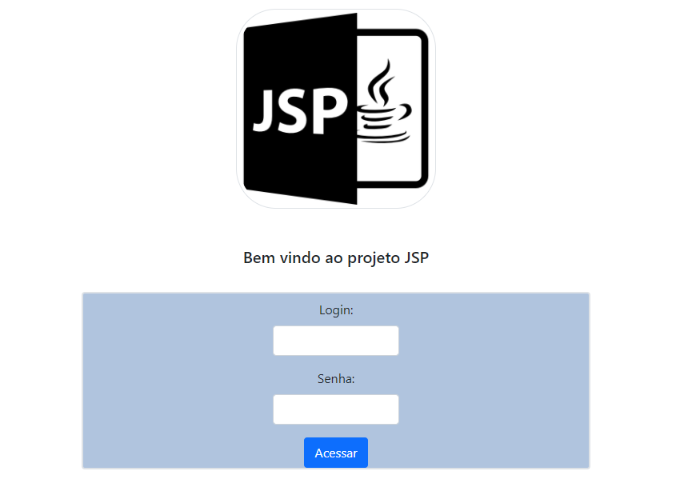
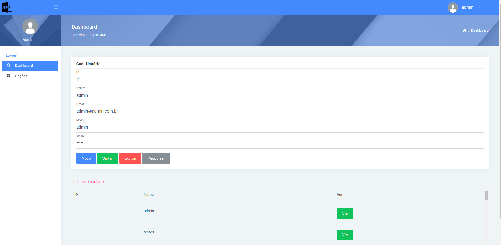
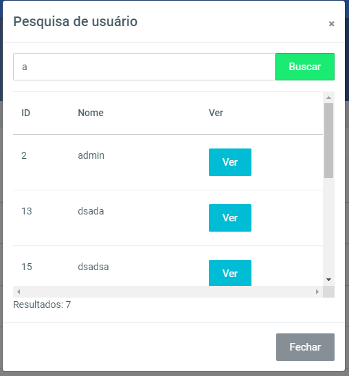

# Projeto JSP

**Aplicação em JSP para criação de usuarios e acesso a aplicação**

Nesta aplicação feita para estudo você pode criar, deletar e editar usuários, estes mesmo usuários terão acesso para logar. no sistema.

# Tela inicial da aplicação.

Qualquer usuário cadastrado terá acesso lembrando que para o primeiro acesso deve criar este usuário manualmente, também dentro do projeto tem um package SQL com anotações das tabelas e colunas criadas no banco de dados.

Banco de dados utilizado neste teste foi o Postgres, entretanto pode ser alterado para qualquer banco de dados relacional através da class SingleConnectionBanco.java dentro do package connection.

# Tela de Cadastro de usuarios.

Nesta tela pode se criar, deletar e editar usuários desde que seguindo as regras dos campos todos estão com validações via JavaScrpit.

# Pesquisa

Tela de pesquisa simples utilizando o operador LIKE para busca, após encontrar o usuário deseja e possível edita-lo.

## Design

Para alcançar este visual foi utilizado template em HTML e Bootstrap provando mais uma vez que pode ser utilizado junto ao JSP fazendo aplicações de boa qualidade.

**Resumo/Status**

O intuito deste projeto foi para aprendizado e demonstração do uso de JSP

